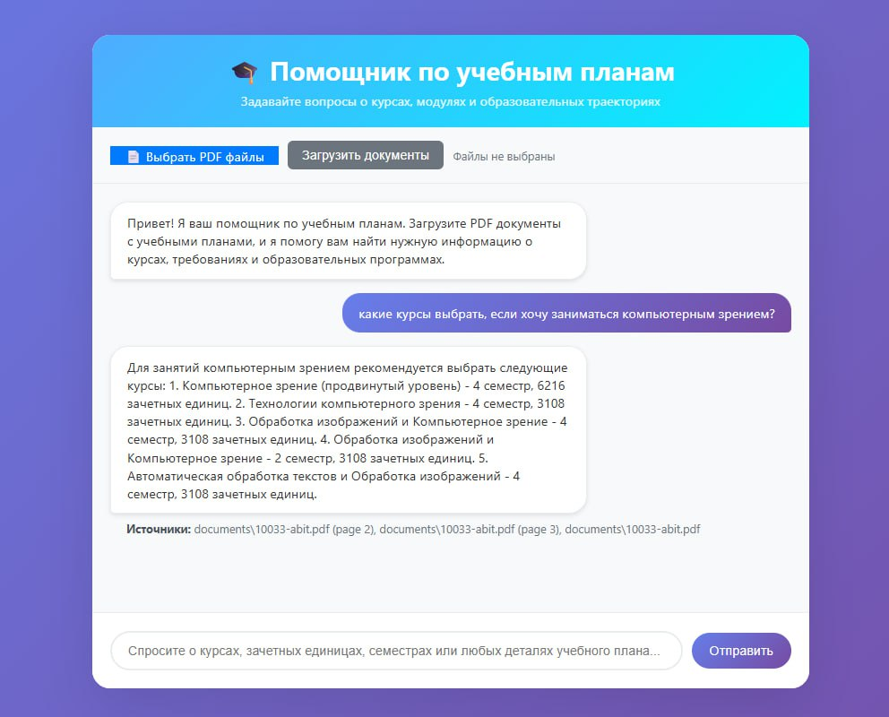

Чат бот для рекомендаций по направлениям обучения в магистратуре AI Talent Hub
В рамках проекта была реализована RAG-система для предоставления рекомендаций по образовательным программам на основе загруженного пользователем PDF-файла.

Использованные инструменты:
* Mistral API — бесплатная и качественная LLM с хорошим лимитом запросов
* LangChain — удобный фреймворк для построения RAG
* Mistral embeddings + FAISS — для поиска релевантной информации
* FastAPI — лёгкий и быстрый бэкенд
* Ванильный HTML/CSS/JS — для простого web-интерфейса

В условиях ограниченного времени был реализован тоьлко базовый функционал:
* Загрузка PDF-документа с программами обучения
* Ответы на вопросы пользователя с учётом содержимого файла

Скриншот:

